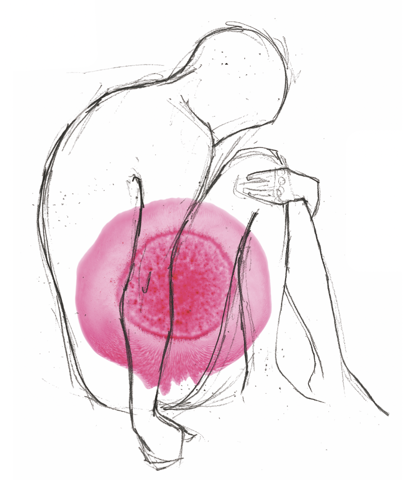

```{r setup, include=FALSE}
knitr::opts_chunk$set(echo = TRUE)
# Load the libraries
library(tidyverse)
library(readr)
library(here)
library(psych)
library(english)
library(stringr)
library(tableone)
library(kableExtra)
library(scales)
library(ggridges)
library(plotly)
library(patchwork)
library(haven)
library(sjPlot)
library(sjmisc)
library(lavaan)
library(bookdown)
library(stats)
```



\newpage

# Executive summary

Compromised fertility in young people is the most life-altering late effect of cancer, and affects domains from sexuality and body image to self-esteem and quality of life. As such, fertility preservation (FP) should become an integral part of cancer rehabilitation for every young patient in Europe.

In order to ddress the existing gaps in knowledge and patient needs related to FP, Youth Cancer Europe developed this project. Using a multimodal, holistic and cross-sectoral approach, this project aims to provide pragmatic, evidence-based, acceptable and scalable solutions to reduce cancer-related fertility inequalities among young people across wider European region. Specific emphasis is put on active involvement of patients at every step. To achieve these aims, we rely on several integral steps of the process:

-	Desktop research and continued review of the existing literature
-	A cross-sectional survey of cancer patients and survivors across European region
-	A qualitative study of lived experience
-	Continuous expert panel consultations

The process is outlined in Figure 1. The overarching goal is the launch of a comprehensive policy campaign for the EU. Other deliverables will include awareness and communication campaign, research and evidence synthesis, as well as policy events at the EU level with the key decision-makers and stakeholders. 


```{r fig-1, echo = FALSE, fig.cap = "Fertility preservation project process and deliverables"}
knitr::include_graphics("process.pdf")


```


<!-- | -->
<!-- |:--:| -->
<!-- | <b>Fig.1 - Fertility preservation project process and deliverables </b>| -->

\newpage

# Introduction

(WE CAN REWORK THIS AS NEEDED)

Fertility is an important issue for many young cancer survivors and perhaps the most life-altering late effect of cancer treatment, affecting the survivors’ body image, sexuality, dating relationships, marriage patterns and sense of wellbeing. 

With studies suggesting that between 40% and 80% of adult female cancer patients are at risk of becoming infertile and between 30% of male cancer patients may become sterile after treatment for cancer, increased survivorship means that the preservation of fertility is becoming an increasingly important topic for patients.

However, despite Europe’s ageing population and an increasing consideration for European citizens’ right to build a family, awareness of this issue remains low and discussions linking fertility and cancer are not highly placed on the European Union’s political agenda. In light of the growing momentum in the field of cancer, we wonder why Europe’s Beating Cancer Plan does not reference fertility issues even once.


Given the EU’s secondary competency in the field of health, ensuring the support of European Member States – and especially the upcoming presidencies of the European Union (Slovenia, France, Sweden, and the Czech Republic) will go a long way towards ensuring the arguments YCE puts forward are heard within the settings of the European Union.

\newpage

# Methodology

(THIS NEEDS SOME MORE WORK :))

This project relies on several steps that build on each other. Among these, the active and ongoing participation of the expert panel and patient representatives is central to the development of each project component, from its inception to the completion. The overarching aims of the project are:

1) Understanding CAYA patient and survivors awareness and information needs and preferences related to fertility preservation services

2) Understanding lived experience (revise based on Eva's qualitative protocol)

3) add?

To address these aims, the team will begin by reviewing the existing literature, and based on that created an online survey, as well as a qualitative study - all of which are described in greater detail below.

\newpage

# Desktop research & Literature review

(REWORK AS NEEDED - Ana?)


YCE will undertake a research project to map currently accessible
fertility presentation and fertility treatment options and costs (EU27). 
We will look at the availability of oncofertility counselling for cancer patients of reproductive age prior to anti-cancer therapy, access to oocyte and embryo cryopreservation as well as ovarian tissue cryopreservation as an alternative procedure when oocyte or embryo cryopreservation are not feasible, including ovarian transposition prior to radiotherapy and gonadal shielding for female patients. We will also map availability of sperm cryopreservation before initiation of anticancer treatments and reducing radiotherapy exposure by shielding or removing the testes from the radiation field for male patients. The study will ask about universal insurance coverage for fertility preservation procedures and storage (details on eligibility criteria) and whether oocyte donation is allowed by local regulations and if it includes any costs. And finally, if there was a cancer plan adopted in the last 15 years, does it includes particular consideration for paediatric cancers, are adolescents and young adults referred to as a specific population, is fertility considered within the national cancer plan and if there are referral pathways for fertility preservation for cancer patients? 

\newpage

# Online survey

YCE’s cross-sectional Survey on Awareness and Accessibility to Fertility Preservation Procedures in Europe will analyse European young cancer survivors' perceptions [1] and their level of satisfaction [2] with information and support available to them during the process of fertility preservation decision-making prior or during their  cancer-related therapy. We also aim to explore the barriers [3] to accessing appropriate fertility preservation counselling (for example financial burden of treatments or issues with referrals to reproductive centres/specialists), and preferences for receiving fertility information. Finally, patient-reported outcome measures [4] will be used to evaluate the impact of fertility issues on the Quality of Life (QoL) and mental health of patients and survivors. Participants will also be asked to report demographic (age, nationality, sexual orientation, completed years of education, and marital status) and medical information (e.g. age at diagnosis, type of diagnosis). 

The survey will be administered via LimeSurvey, a secure and GDPR compliant online platform. The responses will be anonymous and only accessible to the YCE research team.

### Questionnaire construction

The questionnaire was designed with the main aims in mind: (I WILL REVISE AND SUMMARIZE THE ABOVE)

1)

2)

3)

We wanted to make sure that each aspect is explored in enough depth, while keeping in mind the feasibility and length of the survey. 

In addition to the  we added 2 validated questionnaires:

- WHQOOL BREF

Need to add a blurb and provide citation

### Expert panel consultation

-	ESHRE psychologist
-	Katie, lead
-	Eva, PhD – researcher
-	Urska, DPhil
-	Mariana, MA psychogy
-	Patient advocates (4)
- Members of the YCE steering committee

Here I will describe how this was assembled, how and when the feedback was collected.

### Survey revision

Upon the consultation of experts (*N* = 5) and feedback from the patients (*N* = 4), we made a few revisions to the survey. Overall, the participants who volunteered to review the survey expressed positive opinions. On average the survey took 12 minutes to complete.

Here I will list all that was done in the revision - questions changed etc

One of the changes was addition of PHQ


- **Patient Health Questionnaire**: Psychological distress was measured with the Patient Health Questionnaire for Depression and Anxiety (PHQ-4), a 4-item measure of the frequency of 2 anxi- ety symptoms and 2 depressive symptoms on a 4-point Likert scale ranging from 0 (not at all) to 3 (nearly every day). The reliability and validity of the brief PHQ-4 scale have been established in general and clinical populations, and a score of 3 or higher on either subscale and a total score of 6 or higher are indicative of clinically relevant distress. (ADD CITATION)

(I WILL FIX THE MARGINS...)

A copy of the survey is available on the [project repository](https://osf.io/sr37b/).

### Recruitment process

Recruitment into the survey is planned to begin in mid-February 2022 and continue through the summer 2022. The aim is to collect responses from 300-500 patients and survivors from across the European region.

Participants who will fully complete the survey will be asked if they wish to participate in a prize draw for one of the 20 Amazon vouchers (25 Euro each). If they opt to do so, they will be redirected to a separate survey and asked to enter their email. In addition, participants who opt to provide their email, will be asked if they wish to receive YCE's update on the study findings, and if they wish to be contacted for any future studies.

### Participants

Here I will include inclusion and exclusion criteria.

#### Risk and benefits

Participants will be asked about their cancer experience, fertility preservation, and quality of life - topics that may be sensitive, elicit unpleasant memories, feelings, or distress. The sensitive nature of the questions will be included on the information and consent page. Participants will be able to withdraw from the study at any time, however, they will not be able to continue once they do so. Upon the completion of the survey participants will be provided with YCE's researchers contact information. They will be informed that they can contact the research team at any time in order to withdraw their research data from the study. There are no other foreseeable risks associated with participation. 

Alternatively, participants may benefit by participating by feeling that their participation is helping advance science and can have positive impact on other young people in similar situations. If they wish to do so, they may also be selected for one of the gift vouchers.


### Analytical procedure

Demographic information will be summarized descriptively and presented graphically where appropriate.

(NEED TO ADD)


### A priori strengths & limitations

- Broad reach within the EU patient network	
- Retrospective ethical approval will be sought for academic papers
-	These will be a Self-selected sample
-	Only in English, limited generalizability and access to the questionnaire

I will develop this further

\newpage

# Qualitative study

(I BELIEVE THIS NEEDS UPDATING - Eva)

Up to 20 in-depth semi-structured interviews with young adults in Europe are planned for a qualitative module: The lived experiences of young adults with cancer regarding fertility preservation and fertility assistance. The aim of this exploratory study is to provide insight in the lived experiences of young adult cancer survivors with regard to fertility preservation and fertility assistance. The results will inform and assist patient advocates, researchers, healthcare professionals and policy makers in Europe who wish to advance the quality of care of this still understudied and underserved group of patients by developing and implementing best practices for family planning. All the interviews will be recorded upon consent. Transcriptions (ad verbatim) will be produced for the qualitative analysis of the texts. Interpretative phenomenological analysis (IPA) will be chosen for the interview data, as the aim of IPA is to understand how persons make sense of their lived experiences, keeping in mind the context of each singular case before moving on to general themes. IPA resists reductionist tendencies that homogenize patient experiences, privilege dominant narratives, and render the voices of minorities invisible. Analysis will be supported using qualitative analysis software MAXQDA. The in-depth analysis of the interviews will form the basis for the development of a manuscript which will be published in a peer-reviewed (open-access) academic journal.

<-- This needs further elaboration and breakdown like I did above for the survey

\newpage

# Deliverables

(THIS PAGE CAN ALSO BE UPDATED)

## Service

### Awareness and communication

Project narrative and communication materials, including meetings
with institutional stakeholders, and a Presidential Contact Programme to create EU level awareness
on fertility in relation to cancer.

### Implications for clinical practice

Complementing guidelines, findings ways to promote the uptake of guidelines/FP information in a way acceptable and accessible to CAYA patients.

## Research

Two distinct studies to generate evidence and recommend policy actions, as well as provide insights for conducting future research studies within the patient communicites across Europe and abroad.

-	WCC in Geneva online session with experts DR. …
-	Newsletters
-	Blog post
-	Academic publication

## Policy

The launch of YCE’s fertility Project to raise awareness of fertility issues among EU
decision makers and the wider stakeholder ecosystem

\newpage

# Acknowledgments

(PLEASE LIST/ADD AS YOU SEE FIT)

This project would not be possible without the amazing and vibrant YCE community.
Andrea for the visual/graphic support....

