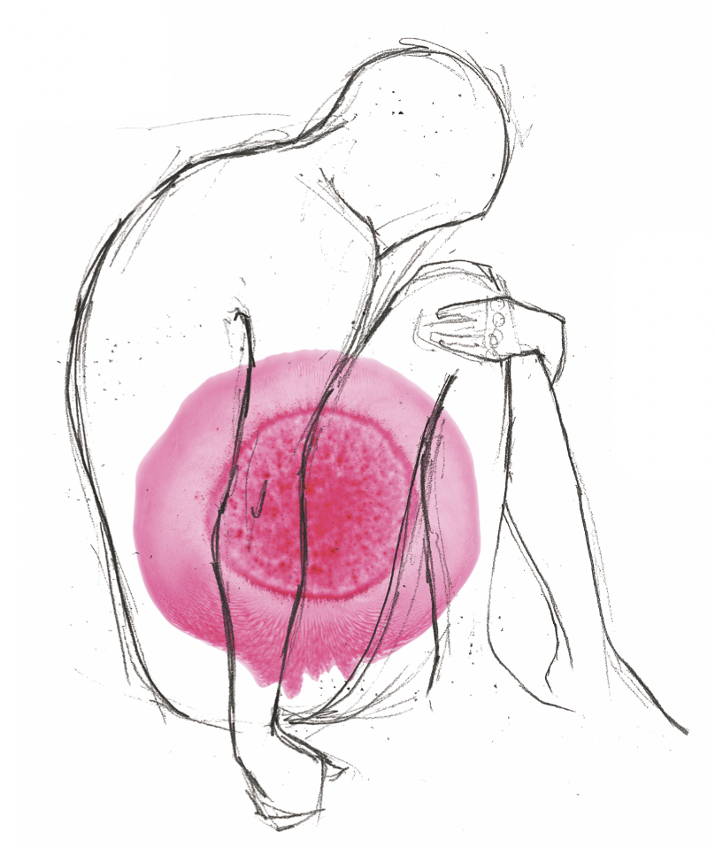

```{r setup, include=FALSE}
knitr::opts_chunk$set(echo = TRUE)
# Load the libraries
library(tidyverse)
library(readr)
library(here)
library(psych)
library(english)
library(stringr)
library(tableone)
library(kableExtra)
library(scales)
library(ggridges)
library(plotly)
library(patchwork)
library(haven)
library(sjPlot)
library(sjmisc)
library(lavaan)
library(bookdown)
library(stats)
```



\newpage

# Abbreviations

-   *CAYA* = Childhood, Adolescent, and Young Adult
- *ESHRE* = European Society of Human Reproduction and Embryology
- *EU* = European Union
-   *FP* = Fertility Preservation
- *GDPR* = General Data Protection Regulation
-   *QOL* = Quality of Life
-   *PHQ-4* = Patient Health Questionnaire
-   *UK* = United Kingdom
-   *YCE* - Youth Cancer Europe
-   *WHO* = World Health Organisation
-   *WHOQOL-BREF* = WHO Quality of life questionnaire, short version

\newpage

# Background & Summary

Compromised fertility in young people is the most life-altering late effect of cancer, and affects domains from sexuality and body image to self-esteem and quality of life. As such, fertility preservation (FP) should become an integral part of cancer rehabilitation for every young patient in Europe.

In order to address the existing gaps in knowledge and patient needs related to FP, Youth Cancer Europe developed and launched a project on fertility preservation among CAYA from across Europe. Using a multimodal, holistic and cross-sectoral approach, the overarching project aims to provide pragmatic, evidence-based, acceptable and scalable solutions to reduce cancer-related fertility inequalities among young people across wider European region. Specific emphasis is put on active involvement of patients at every step. To achieve these aims, there are several integral steps of the process:

-   Desktop research and continued review of the existing literature
-   A cross-sectional survey of cancer patients and survivors across European region
-   A qualitative study of lived experience
-   Continuous expert panel consultations

The process is outlined in Figure 1. The overarching goal is the launch of a comprehensive policy campaign for the EU. Other deliverables will include awareness and communication campaign, research and evidence synthesis, as well as policy events at the EU level with the key decision-makers and stakeholders. The present document outlines the online survey development and preparation.

```{r fig-1, echo = FALSE, fig.cap = "Fertility preservation project process and deliverables"}
knitr::include_graphics("process.pdf")


```

\newpage

# Survey description

Youth Cancer Europe's cross-sectional Survey on Awareness and Accessibility to Fertility Preservation Procedures in Europe will analyse young cancer patients' survivors' perceptions and their level of satisfaction with information and support available to them during the process of fertility preservation decision-making at any step of their cancer illness. We also aim to explore the barriers to accessing appropriate fertility preservation counselling (e.g. financial burden of treatments or issues with referrals to reproductive centres/specialists), and preferences for receiving fertility-related information. Finally, patient-reported outcome measures will be used to evaluate the impact of fertility issues on the Quality of Life (QOL) and mental health of patients and survivors. Participants will be asked to report demographic (age, nationality, sexual orientation, completed years of education, and marital status) and medical information (e.g. age at diagnosis, type of diagnosis).

The survey will be administered via LimeSurvey, a secure and GDPR compliant online platform. The responses will be anonymous and only accessible to the YCE research team.

### Questionnaire construction

The questionnaire was designed to address the main aims:

1)  Assess patients' and survivors' fertility preservation service *awareness*, *satisfaction*, and *preferences* in decision-making process

2)  Assess *availability*, *affordability* and other *barriers* among patients' and survivors'

3)  Assess *quality of life* and *well being* and ask how that may have been impacted by access (or lack there-of) to fertility preservation services

    1.  To do so we decided to use WHO's Quality of Life questionnaire (WHOQOL-BREF), a short version of WHOQOL-100 that has 26 items and is a multilingual, multicultural generic QOL measure developed across 15 major field centers. The questionnaire has four domains that assess quality of life: physical health, psychological health, social relationships and environment, as well as one facet that asks about overall quality of life and general health. All items are rated on a 5-point Likert scale. A higher overall score indicates higher quality of life. Reliability and validity of the measure has been well established [@whoqol; @Skevington2004], including for the use with a range of patients with chronic health conditions [@Aigner2006].

We wanted to make sure that each aspect is explored in enough depth, while keeping in mind the feasibility and length of the survey.

### Expert panel consultation and survey revision

The study aims and initial draft of the survey were presented to a multidisciplinary and international expert panel including 3 independent reviewers (an ESHRE psychologist, 2 senior researchers - Portugal, Switzerland, UK) along with the director of YCE, a clinical psychologist in training (Portugal), 4 patient advocates, and the steering committee of the YCE.

Upon the consultation of experts (*N* = 5) and direct feedback from the patients (*N* = 6), we made a few revisions to the survey. Overall, the participants who volunteered to review the survey expressed positive opinions. On average the survey took 12 minutes to complete. A summary of feedback and survey changes is outlined below:

1)  Added the following countries to the list: Israel, Azerbaijan, Kazakhstan, Kyrgyzstan, Tajikistan, Uzbekistan

2) Added YCE logo to the left top corner of the survey

3) After the consent, we added an image and ask participants to perform simple calculation (2+2) in order to add another check for automated bot responses.

4) Added the option for participants to back on the survey and edit/change their answers. 

5) Added "Help" section in questions about barriers: *"If yes, please provide explicit examples and tell us about your experience"*

6) Added "Transplant" to the list of of treatments 

7) For Question "What type of fertility preservation procedure did you undergo?", changed the question type to "multiple choice" rather than single choice.

2)  Additions to the survey:

Because only those who have actually had access to the fertility preservation services are asked in greater detail about their decision-making process we added two questions about preferences in FP for all participants. The first question asks participants to rank the order of sources from which they like to get the information on FP, the second question asks about the importance of several factors (e.g. involvements of parents) in the decision-making process.

The second addition was a short measure to more accurately assess participants' mental health.

-   **Patient Health Questionnaire**: Psychological distress was measured with the Patient Health Questionnaire for Depression and Anxiety (PHQ-4), a 4-item measure of the frequency of 2 anxi- ety symptoms and 2 depressive symptoms on a 4-point Likert scale ranging from 0 (not at all) to 3 (nearly every day). The reliability and validity of the brief PHQ-4 scale have been established in general and clinical populations, and a score of 3 or higher on either subscale and a total score of 6 or higher are indicative of clinically relevant distress. [@Kroenke2009]

Lastly, because the survey is cross-sectional in nature and the validated questionnaires are not directly asking about FP and how the measured constructs may be related to fertility, we ask particpants to report, if they think their quality of life and/or mental health have been impacted by cancer-related fertility difficulties.

A published copy of the survey is available on the [project repository](https://osf.io/sr37b/).

*NB*: Some minor text edits might have occurred after the posting.

### Srudy information and participants' consent

This document describing the survey and its development is freely available for participants to view and/or download. The introductory page of the survey presents the study aims, informs participants that, if willing, they can enter the draw for prize vouchers, and informs them on the LimeSurvey platform policy and data protection. 

Upon reading the text, in order to participate in the survey, participants must consent and confirm that they have read the information and are 18 years or older.

### Participants

Participants are cancer patients with a cancer diagnosis before the age 39. Table 1 outlines inclusion and exclusion criteria:

+-------------------------------------------------------------------------------------------------------------------------------------------------------+-------------------------------------+
| Inclusion                                                                                                                                             | Exclusion                           |
+=======================================================================================================================================================+=====================================+
| -   Any cancer diagnosis \<39 years of age                                                                                                            | -   Current age at least 18 years   |
|                                                                                                                                                       |                                     |
| -   Treated for cancer in the wider European region (includes Russia, Armenia, Azerbaijan, Israel, Kazakhstan, Kyrgyzstan, Tajikistan and Uzbekistan) | -   Can read and respond in English |
+-------------------------------------------------------------------------------------------------------------------------------------------------------+-------------------------------------+

:   Inclusion and exclusion criteria

### Recruitment process

Recruitment into the survey is planned to begin in mid-February 2022 and continue through the summer 2022. The aim is to collect responses from a minimum of 300-500 patients and survivors from across the wider European region (including Russia, Armenia, Azerbaijan, Kazakhstan, Kyrgyzstan, Tajikistan or Uzbekistan).

Participants will be self-identified and self-selected cancer patients and survivors from the wider European region. Initially, an anonymous survey link will be circulated internally on the YCE's mailing list and via the newsletter. Secondly, YCE will reach specific national and international working groups that involve and advocate for CAYA patients and invite the communities to share the survey link within their circles. Lastly, we will share advertisement material on Twitter, Instagram and other relevant social media where we will target cancer-related groups and charities (e.g. EuropaDonna). Copies of the advertisment emails and posts are also available on the [project repository](https://osf.io/sr37b/).

Participants who will complete the survey will be asked if they wish to participate in a prize draw for one of the 20 Amazon vouchers (valued 25 Euro each). If they opt to do so, they will be redirected to a separate survey and asked to enter their email. In addition, participants who opt to provide their email, will be asked if they wish to receive YCE's update on the study findings, and if they wish to be contacted for any future studies.

#### Risk and benefits

Participants will be asked about their cancer experience, fertility preservation, and quality of life - topics that may be sensitive, elicit unpleasant memories, feelings, or distress. The sensitive nature of the questions will be included on the information and consent page. Participants will be able to withdraw from the study at any time, however, they will not be able to continue once they do so. Upon the completion of the survey participants will be provided with YCE's researchers contact information. They will be informed that they can contact the research team at any time in order to withdraw their research data from the study. There are no other foreseeable risks associated with participation.

Alternatively, participants may benefit by participating and by feeling that their participation is helping to improve fertility preservation and related services and can have positive impact on other young people facing similar diagnoses and cancer-related challenges If they wish to do so, they may also be included in the prize draw for one of the gift vouchers.

### Data protection

Participation in this anonymous survey is entirely voluntary. LimeSurvey is a secure online platform and GDPR compliant. The responses provided by participants will be hosted on the LimeSurvey Cloud online service and YCE's researchers will only have access to already anonymised data. IP addresses will not be recorded nor stored. Participants are informed that they can safely withdraw at any time by closing the browser window. In this case, their data will not be used for any analyses. Further information about your rights and LimeSurvey privacy policy can be found [*here*](www.limesurvey.org/support/faq/39-data-protection-and-policy).

### Analytic procedure and outputs

The detailed list of variables and data collected is available on the [project repository](https://osf.io/sr37b/). A detailed analytical plan will be presented and publish on the page as well. The data from this study will contribute to a better understanding of oncofertility-related needs and barriers among CAYA patients and survivors from the European region. The results and findings will form the basis of writing a white paper and policy recommendations. The findings will also be disseminated via presentations, conferences, academic articles and wider publications.

#### Conflict of interest

The researchers involved with this study have no conflict of interest to declare.

## Contact
In case of any questions or concerns please reach us [*here*](mailto:research@youthcancereurope.org).

***
Version: 1


This document was last updated on: `r Sys.Date()`

<!-- **Changes**: -->


\newpage

# Bibliography
