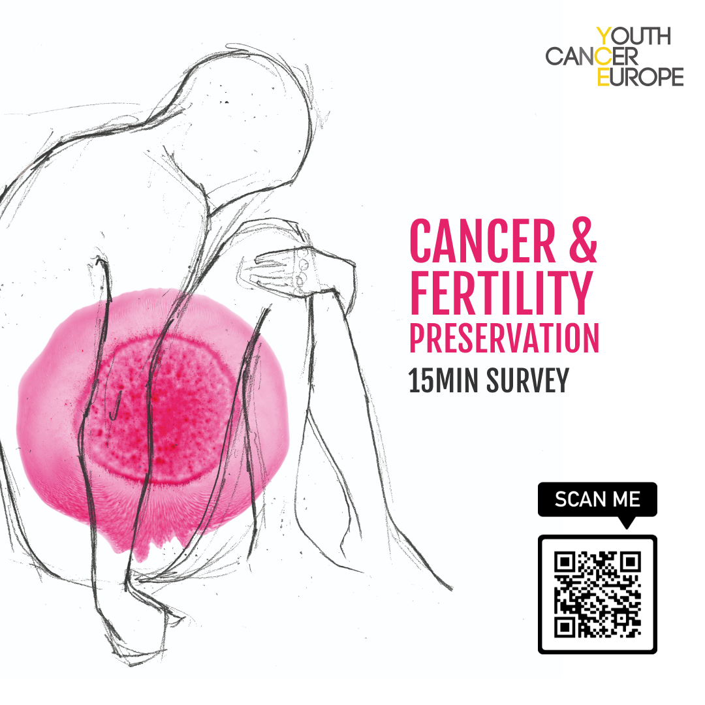

# Fertility preservation and family planning for Childhood, Adolescent, and Young Adult (CAYA) cancer patients across Europe

This is a repository for an online survey study, which is part of a larger fertility preservation project led by Youth Cancer Europe. To read more about the aims and methodology click [here](https://osf.io/sr37b/).

